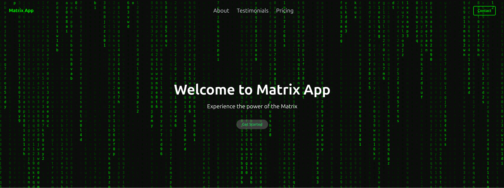

# Matrix App Landing Page
Landing page temática com efeito visual de código em cascata e animações fluidas.


[Ver projeto →](https://matrix-app-landing.vercel.app/)

---

<p align="center">
  
</p>

---

## 🚀 Features

- **Revelação ao Scroll**: Implementação de `react-intersection-observer` para disparar animações do Framer Motion apenas quando o conteúdo entra no viewport, otimizando a performance de renderização e a experiência do usuário.
- **Identidade Visual Temática**: Componente `MatrixRainingCode` dedicado para a criação do efeito visual de cascata, estabelecendo a atmosfera do produto logo no carregamento da página.
- **Design Responsivo**: Utilização de Tailwind CSS para garantir a adaptabilidade do layout em diferentes resoluções, mantendo a consistência visual sem a necessidade de arquivos CSS extensos.
- **Build de Alta Performance**: Uso do Vite para garantir Hot Module Replacement (HMR) instantâneo durante o desenvolvimento e otimização de bundles para produção.

---

## 🛠️ Tecnologias

- **React** ^18.2.0
- **Vite** ^5.2.0
- **Tailwind CSS** ^3.4.3
- **Framer Motion** ^11.1.9
- **React Intersection Observer** ^9.10.2
- **React Scroll** ^1.9.0

---

## 💻 Como rodar localmente

1. Clone o repositório:
   ```bash
   git clone [URL_DO_REPOSITORIO]
   cd matrix-website
   ```

2. Instale as dependências:
   ```bash
   npm install
   ```

3. Inicie o servidor de desenvolvimento:
   ```bash
   npm run dev
   ```

4. Acesse no navegador:
   `http://localhost:5173`

---

## 📂 Estrutura de Pastas

```text
src/
├── assets/       # Recursos estáticos (SVGs, imagens)
├── components/   # Componentes de UI reutilizáveis e seções da página
│   ├── Hero.jsx          # Seção principal de destaque
│   ├── Features.jsx      # Grade de funcionalidades
│   ├── MatrixRainingCode.jsx # Efeito visual de fundo
│   └── ...
├── App.jsx       # Orquestração das páginas e componentes
└── main.jsx      # Ponto de entrada da aplicação
```

---